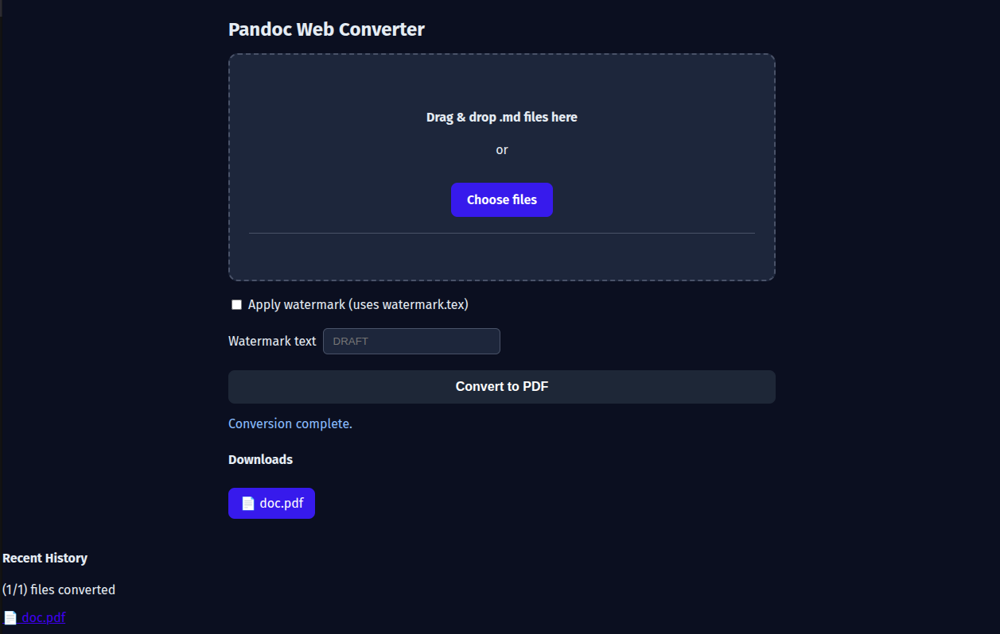

# 📄 Pandoc Markdown → PDF Web UI

A simple, drag-and-drop web application that converts Markdown files to beautifully formatted PDFs. Perfect for generating professional documents, reports, documentation, and more from your Markdown files.

**License**: AGPL-3.0-only (see `LICENSE`)

---

## 📑 Table of Contents

- [What is This?](#what-is-this)
- [Key Features](#key-features)
- [Prerequisites](#prerequisites)
- [Quick Start Guide](#quick-start-guide)
- [Using the Web Interface](#using-the-web-interface)
- [REST API Usage](#rest-api)
- [Configuration Options](#configuration)
- [Font Customization](#fonts)
- [Development Setup](#development)
- [Troubleshooting](#troubleshooting)
- [Security Notes](#security-notes)
- [Project Structure](#project-layout)
- [License](#license)

---

## 🎯 What is This?

This tool provides a user-friendly web interface for converting Markdown (`.md`) files into professional PDF documents. Instead of manually running command-line tools, simply drag and drop your Markdown file into a browser, and get a formatted PDF in seconds.

**Use Cases:**

- Generate PDF reports from Markdown documentation
- Create professional-looking documents without LaTeX knowledge
- Add "DRAFT" or custom watermarks to documents
- Automate document generation via REST API
- Convert technical documentation to PDF format

**How It Works:**
Under the hood, this uses [Pandoc](https://pandoc.org/) with XeLaTeX to handle the conversion, providing high-quality typesetting and font support.

---

## ✨ Key Features

- 🖱️ **Simple Drag-and-Drop UI** - No command line required
- 📝 **Markdown to PDF Conversion** - High-quality output using Pandoc/XeLaTeX
- ↔️ **Portrait/Landscape** - Choose between portrait and landscape orientation
- 📐 **Multiple Paper Sizes** - Select from standard paper sizes (Letter, A4, etc.)
- 🏷️ **Optional Watermarks** - Add "DRAFT" or custom text watermarks
- 🔧 **Custom Lua Filters** - Create and save custom Pandoc Lua filters for advanced document processing
- 🎨 **Beautiful Typography** - Professional Libertinus font family included
- ⚡ **Fast & Lightweight** - Minimal Docker container, quick startup
- 🔒 **Secure** - 10MB file limit, isolated temporary directories per request, rate limiting
- 🌐 **REST API** - Integrate with scripts, CI/CD, or other applications
- ❤️ **Health Checks** - Built-in endpoint for container monitoring

**Default PDF Styling:**

- Letter-sized paper (8.5" × 11")
- 1-inch margins on all sides
- Libertinus Serif for body text
- Libertinus Mono for code blocks
- Paragraph spacing for readability

---

## 📸 Screenshot



---

## 📋 Prerequisites

**To run this application, you need:**

- **Docker** (recommended) - [Install Docker](https://docs.docker.com/get-docker/)
  - Docker Desktop for Windows/Mac
  - Docker Engine for Linux
- **OR** Docker Compose (included with Docker Desktop)

**That's it!** All other dependencies (Pandoc, LaTeX, fonts, Node.js) are bundled in the Docker image.

**Checking if Docker is installed:**

```bash
docker --version
docker compose version
```

---

## 🚀 Quick Start Guide

### Method 1: One-Shot Install (Recommended)

This is the fastest and easiest way to get the application running. No need to clone the repository—just run this command in your terminal:

```bash
curl -sSL https://raw.githubusercontent.com/clayauld/pandoc-md2pdf-web/main/install.sh | bash
```

**What does this do?**

- It downloads and runs the `install.sh` script.
- The script creates a directory at `~/pandoc-md2pdf-web`.
- It downloads the necessary `docker-compose.yml` and `.env` files into that directory.
- It starts the application using the pre-built Docker image.

After installation, the application will be running at **http://localhost:8080**.

To stop the application, run:

```bash
cd ~/pandoc-md2pdf-web && docker compose down
```

### Method 2: For Developers (Manual Setup)

If you want to modify the code, you'll need to clone the repository:

1. **Clone the repository**

```bash
git clone https://github.com/clayauld/pandoc-md2pdf-web.git
cd pandoc-md2pdf-web
```

2. **Start the application**
   - For a production-like environment:
     ```bash
     docker compose up --build
     ```
   - For development with hot-reloading:
     ```bash
     docker compose -f docker-compose.yml -f docker-compose.override.yml up --build
     ```

3. **Open your browser**
   - Navigate to: http://localhost:8080

4. **Stop the application**
   - Press `Ctrl+C` or run: `docker compose down`

If you're modifying the code and want automatic reloading:

```bash
docker compose -f docker-compose.yml -f docker-compose.override.yml up --build
```

This mounts your local `public/` and `server/` directories into the container, so changes are reflected immediately.

---

## 💻 Using the Web Interface

### Step-by-Step Instructions

1. **Open the application** in your browser (http://localhost:8080)

2. **Upload your Markdown file** by either:
   - Dragging and dropping a `.md` file onto the page
   - Clicking the upload area to browse for a file

3. **Configure watermark (optional)**:
   - Toggle the "Apply watermark" checkbox
   - Enter custom watermark text (defaults to "DRAFT")
   - Watermarks appear diagonally across each page

4. **Configure custom Lua filter (optional)**:
   - Expand the "Custom Lua Filter" section
   - Enter a filter name and Lua filter code
   - Choose filter mode:
     - **Override default filter**: Use only your custom filter
     - **In addition to default filter**: Apply both default and custom filters
   - Click "Save Filter" to persist your configuration
   - Toggle "Use custom filter" to enable/disable it for conversions

5. **Click "Convert to PDF"**
   - The conversion happens on the server
   - Your browser will download the PDF automatically
   - The PDF has the same base filename as your Markdown file

6. **Open the PDF** in your favorite PDF viewer

### Example Use Case

Let's say you have a file named `meeting-notes.md`:

```markdown
# Meeting Notes - Q4 Planning

## Attendees

- Alice (Engineering)
- Bob (Product)

## Discussion Points

- Feature roadmap for next quarter
- Resource allocation
```

1. Upload `meeting-notes.md`
2. Enable watermark with text "DRAFT"
3. Download `meeting-notes.pdf` with a professional layout and diagonal "DRAFT" watermark

---

## 🌐 REST API Usage

The application provides a REST API for programmatic access, perfect for automation, CI/CD pipelines, or integrating into other applications.

### POST `/convert` - Convert Markdown to PDF

**Endpoint**: `http://localhost:8080/convert`

**Request Format**: `multipart/form-data`

**Parameters**:

`files`
: **File[]** (✅ Yes) - One or more Markdown (`.md`) files (can upload multiple files)

`orientation`
: **String** (No, default: `portrait`) - Page orientation (`portrait` or `landscape`)

`paperSize`
: **String** (No, default: `letter`) - Paper size (`letter`, `legal`, `tabloid`, `a3`, `a4`, or `a5`)

`watermark`
: **Boolean** (No, default: `false`) - Enable watermark (`true` or `false`)

`watermarkText`
: **String** (No, default: `DRAFT`) - Custom watermark text (only used if `watermark=true`)

**Response**:

`200` (`application/json`)
: Successfully queued conversion(s). Returns:

```json
{
  "id": "unique-job-id",
  "results": [
    {
      "name": "document.pdf",
      "originalName": "document.md",
      "success": true
    }
  ]
}
```

To download the PDF, use: `GET /download/:id/:filename`

`400` (`application/json`)
: Missing or invalid file: `{ "error": "message" }`

`500` (`application/json`)
: Conversion failed: `{ "error": "message", "details": "..." }`

### Examples

#### Example 1: Basic Conversion (using curl)

```bash
# Step 1: Upload and convert
RESPONSE=$(curl -X POST 'http://localhost:8080/convert' \
  -F 'files=@my-document.md')

# Step 2: Extract the job ID and filename from the response
ID=$(echo $RESPONSE | jq -r '.id')
FILENAME=$(echo $RESPONSE | jq -r '.results[0].name')

# Step 3: Download the PDF
curl -X GET "http://localhost:8080/download/${ID}/${FILENAME}" \
  -o my-document.pdf
```

**Note**: The field name must be `files` (plural), not `file` (singular).

#### Example 2: With Custom Watermark

```bash
# Step 1: Upload and convert with watermark
RESPONSE=$(curl -X POST 'http://localhost:8080/convert' \
  -F 'files=@proposal.md' \
  -F 'watermark=true' \
  -F 'watermarkText=CONFIDENTIAL')

# Step 2: Extract the job ID and filename
ID=$(echo $RESPONSE | jq -r '.id')
FILENAME=$(echo $RESPONSE | jq -r '.results[0].name')

# Step 3: Download the PDF
curl -X GET "http://localhost:8080/download/${ID}/${FILENAME}" \
  -o proposal.pdf
```

#### Example 3: Using Python (requests library)

```python
import requests
import json

# Step 1: Upload and convert
with open('document.md', 'rb') as f:
    files = {'files': ('document.md', f, 'text/markdown')}
    data = {
        'watermark': 'true',
        'watermarkText': 'INTERNAL USE ONLY'
    }

    response = requests.post(
        'http://localhost:8080/convert',
        files=files,
        data=data
    )

    if response.status_code == 200:
        result = response.json()
        job_id = result['id']
        pdf_filename = result['results'][0]['name']

        # Step 2: Download the PDF
        download_url = f'http://localhost:8080/download/{job_id}/{pdf_filename}'
        pdf_response = requests.get(download_url)

        if pdf_response.status_code == 200:
            with open('document.pdf', 'wb') as pdf_file:
                pdf_file.write(pdf_response.content)
            print('✅ PDF generated successfully!')
        else:
            print(f'❌ Download failed: {pdf_response.status_code}')
    else:
        print(f'❌ Conversion failed: {response.json()}')
```

#### Example 4: Using JavaScript (Node.js with axios)

```javascript
const axios = require("axios");
const FormData = require("form-data");
const fs = require("fs");

async function convertToPDF() {
  const form = new FormData();
  form.append("files", fs.createReadStream("document.md"));
  form.append("watermark", "true");
  form.append("watermarkText", "DRAFT");

  try {
    // Step 1: Upload and convert
    const convertResponse = await axios.post(
      "http://localhost:8080/convert",
      form,
      {
        headers: form.getHeaders(),
      },
    );

    const { id, results } = convertResponse.data;
    const pdfFilename = results[0].name;

    // Step 2: Download the PDF
    const downloadUrl = `http://localhost:8080/download/${id}/${pdfFilename}`;
    const pdfResponse = await axios.get(downloadUrl, {
      responseType: "stream",
    });

    pdfResponse.data.pipe(fs.createWriteStream("document.pdf"));
    console.log("✅ PDF generated successfully!");
  } catch (error) {
    console.error("❌ Error:", error.response?.data || error.message);
  }
}

convertToPDF();
```

### GET `/healthz` - Health Check

**Endpoint**: `http://localhost:8080/healthz`

**Purpose**: Check if the service is running (useful for container orchestration, monitoring, load balancers)

**Response**:

```json
{
  "ok": true
}
```

**Example**:

```bash
curl http://localhost:8080/healthz
# Returns: {"ok":true}
```

### Filter Management API

The application provides endpoints for managing custom Lua filters that can be used to customize Pandoc's conversion behavior.

#### GET `/api/filter/default` - Get Default Filter

**Endpoint**: `http://localhost:8080/api/filter/default`

**Purpose**: Retrieve the default Lua filter code used by the application

**Response**:

- `200` (`text/plain`) - Returns the Lua filter code as plain text
- Rate limited to 20 requests per minute per IP

**Example**:

```bash
curl http://localhost:8080/api/filter/default
# Returns the default filter.lua content
```

#### GET `/api/filter/custom` - Get Custom Filter

**Endpoint**: `http://localhost:8080/api/filter/custom`

**Purpose**: Retrieve the saved custom filter configuration and code

**Response**:

`200` (`application/json`)
: Returns the custom filter configuration.

If a custom filter is configured, it returns an object with its details:

```json
{
  "name": "custom-filter",
  "code": "-- Lua filter code here\nfunction Pandoc(doc)\n  return doc\nend",
  "mode": "additional",
  "enabled": true
}
```

If no custom filter is configured, it returns:

```json
{
  "enabled": false
}
```

- Rate limited to 20 requests per minute per IP

**Example**:

```bash
curl http://localhost:8080/api/filter/custom
```

#### POST `/api/filter/save` - Save Custom Filter

**Endpoint**: `http://localhost:8080/api/filter/save`

**Purpose**: Save or update a custom Lua filter configuration

**Request Format**: `application/json`

**Body Parameters**:

`name`
: **String** (Conditionally required) - Filter name (sanitized for filename)

- **Required** when `enabled` is `true` or not provided (creating/enabling a filter)
- **Optional** when `enabled` is `false` (will use existing filter name if omitted)

`code`
: **String** (Conditionally required) - Lua filter code

- **Required** when `enabled` is `true` or not provided (creating/enabling a filter)
- **Optional** when `enabled` is `false` (filter file won't be updated if omitted)

`mode`
: **String** (Optional, default: `additional`) - Filter mode:

- `"override"` - Replace the default filter
- `"additional"` - Apply after the default filter

`enabled`
: **Boolean** (Optional, default: `true`) - Whether the filter is enabled

**Response**:

`200` (`application/json`)
: Success:

```json
{
  "success": true,
  "name": "custom-filter"
}
```

`400` (`application/json`)
: Validation error: `{ "error": "message" }`

`500` (`application/json`)
: Server error: `{ "error": "message", "details": "..." }`

- Rate limited to 20 requests per minute per IP

**Examples**:

Creating or enabling a filter:

```bash
curl -X POST http://localhost:8080/api/filter/save \
  -H "Content-Type: application/json" \
  -d '{
    "name": "my-custom-filter",
    "code": "-- My custom filter\nfunction Pandoc(doc)\n  return doc\nend",
    "mode": "additional",
    "enabled": true
  }'
```

Disabling a filter (name and code are optional):

```bash
curl -X POST http://localhost:8080/api/filter/save \
  -H "Content-Type: application/json" \
  -d '{
    "enabled": false
  }'
```

---

## ⚙️ Configuration Options

### Environment Variables

You can customize the application behavior using environment variables:

`PORT`
: **Default**: `8080` - Port the web server listens on

`NODE_ENV`
: **Default**: `production` - Set to `development` for verbose logging

**Example: Running on a different port**

```bash
docker run --rm -p 3000:3000 -e PORT=3000 ghcr.io/clayauld/pandoc-md2pdf-web:latest
```

### PDF Conversion Settings

The application uses sensible defaults for PDF generation. These are configured in `server/index.js`:

`PDF Engine`
: **Default**: `xelatex` - LaTeX engine (supports Unicode and modern fonts)

`Paper Size`
: **Default**: `letter` - US Letter (8.5" × 11"). Change to `a4` for European standard

`Margins`
: **Default**: `1in` - All sides have 1-inch margins

`Main Font`
: **Default**: `Libertinus Serif` - Professional serif font for body text

`Mono Font`
: **Default**: `Libertinus Mono` - Monospace font for code blocks

`Document Class`
: **Default**: `article` - LaTeX document class

`Paragraph Spacing`
: **Default**: `12pt` - Space between paragraphs

**Advanced**: To modify these settings, edit the Pandoc arguments in `server/index.js` and rebuild the image.

### Overriding Conversion Assets

For advanced customization, you can override the default `filter.lua` and `watermark.tex` files by mounting your own versions into the container. This is useful for modifying conversion logic without rebuilding the Docker image.

**Note**: The web UI also provides a "Custom Lua Filter" section where you can create, save, and manage custom filters without mounting files. Use the mounted file approach only if you want to change the system-wide default filter that's used as the base for all conversions.

Create a directory on your host machine (e.g., `./my_assets`) and place your custom files inside:

```
my_assets/
  ├── filter.lua
  └── watermark.tex
```

Then, add a `volumes` mapping to your `docker-compose.yml`:

```yaml
services:
  web:
    # ... other settings
    volumes:
      # Mount your custom assets to their in-container locations
      - ./my_assets/filter.lua:/app/filter.lua
      - ./my_assets/watermark.tex:/app/watermark.tex
```

Restart the container (`docker compose up -d --force-recreate`) to apply the changes. The application will now use your local files for the conversion process.

**Note**: Ensure that your mounted files have the correct permissions for the container to read them. If you encounter permission issues, make sure the files are readable:

```bash
chmod +r ./my_assets/*
```

### Special Features

- **Custom Lua Filters**: Create and manage custom Pandoc Lua filters via the web UI or API. Filters can either override the default filter or be applied in addition to it. Filters are persisted on the server and can be enabled/disabled without losing configuration. Use the "Custom Lua Filter" section in the web interface to create filters that modify document structure, add custom processing, or implement advanced formatting rules.
- **Default Filter**: The included `filter.lua` file is currently empty (contains only commented-out code) and does not perform any processing by default. See [Overriding Conversion Assets](#overriding-conversion-assets) for details on overriding it via Docker volumes, or use the web UI's custom filter feature with "override" mode to replace it on a per-request basis.
- **Watermarks**: When enabled, injects `watermark.tex` which uses the LaTeX `draftwatermark` package

### Meeting Notes Generator

The application includes an optional "Meeting Notes" generator that uses an LLM (Large Language Model) to create professional meeting minutes from transcripts.

**Enabling the Feature:**
Set the environment variable `ENABLE_MEETING_NOTES=true` in your `.env` or `docker-compose.yml` file.

**Configuration:**
The generator uses **LiteLLM** or any OpenAI-compatible API.

- `ENABLE_MEETING_NOTES`: Set to `true` to show the "Meeting Notes" tab.
- `LLM_API_BASE`: The base URL for the LLM API (e.g., `http://litellm:4000` for local LiteLLM, or `https://api.openai.com/v1`).
- `LLM_API_KEY`: Your API key for the LLM provider.
- `LLM_MODEL`: The model to use (default: `gpt-3.5-turbo`).

**Usage:**

1. Switch to the "Meeting Notes" tab.
2. Upload a **Transcript** (required).
3. Optionally provide an **Agenda** (by uploading a file or pasting text directly).
4. Optionally provide an **Attendance** list (by pasting text).
5. Optionally upload **Past Minutes (Context)**, or a **Template**.
6. Click "Generate Meeting Notes".
7. Edit the generated Markdown in the live editor.
8. Click "Convert to PDF" to generate the final PDF document.

---

## 🎨 Font Customization

### Using Custom Fonts

The Docker image includes the **Libertinus** font family by default. To use your own fonts:

1. **Add font files** to the `server/fonts/` directory
   - Supported formats: `.otf` (OpenType) or `.ttf` (TrueType)
   - Example structure:
     ```
     server/fonts/
       OTF/
         MyFont-Regular.otf
         MyFont-Bold.otf
         MyFont-Italic.otf
     ```

2. **Update the font configuration** in `server/index.js`:

   ```javascript
   '-V', 'mainfont=My Font Family Name',
   '-V', 'monofont=My Mono Font',
   ```

3. **Rebuild the Docker image**:
   ```bash
   docker compose up --build
   ```

The Dockerfile automatically:

- Installs `fontconfig` for font management
- Copies fonts from `server/fonts/` to `/usr/local/share/fonts/custom/`
- Refreshes the font cache with `fc-cache -fv`

### Finding Font Names

To find the exact name XeLaTeX expects, inside the container run:

```bash
docker compose exec web fc-list | grep "YourFont"
```

### Included Fonts

The Libertinus font family provides:

- **Libertinus Serif** - Body text (Regular, Bold, Italic, Bold Italic, Semibold)
- **Libertinus Sans** - Sans-serif variant
- **Libertinus Mono** - Code blocks and monospace text
- **Libertinus Math** - Mathematical typesetting

---

## 🛠️ Development Setup

### Prerequisites for Development

- Docker & Docker Compose
- A text editor (VS Code, Sublime Text, etc.)
- Basic knowledge of Node.js/Express (for backend modifications)

### Running in Development Mode

1. **Clone the repository**:

```bash
git clone https://github.com/clayauld/pandoc-md2pdf-web.git
cd pandoc-md2pdf-web
```

2. **Start with hot-reload enabled**:

```bash
docker compose -f docker-compose.yml -f docker-compose.override.yml up --build
```

3. **The override file (`docker-compose.override.yml`) mounts**:
   - `./public/` → `/app/public/` (frontend files)
   - `./server/` → `/app/server/` (backend code)
   - Container's `node_modules` are preserved (no conflicts with your local machine)

4. **Make changes** to files in `public/` or `server/`, and they'll be reflected immediately

### Viewing Logs

**View live logs**:

```bash
docker compose logs -f web
```

**View only errors**:

```bash
docker compose logs web | grep -i error
```

### Technology Stack

- **Frontend**: Vanilla HTML/CSS/JavaScript (no frameworks, lightweight)
- **Backend**: Node.js 20+ with Express.js
- **Conversion**: Pandoc 3.x + XeLaTeX + TeXLive
- **Container**: Docker with Alpine base image

### Making Changes

**To modify the UI**:

- Edit files in `public/` (HTML, CSS, JS)

**To change conversion logic**:

- Edit `server/index.js` (Pandoc arguments, routes)
- Edit `server/scripts/convert_to_pdf.sh` (shell script wrapper)
- Edit `server/scripts/filter.lua` (Lua filter)
- Edit `server/scripts/watermark.tex` (LaTeX watermark template)

**To add dependencies**:

- Update `server/package.json`
- Rebuild: `docker compose up --build`

---

## 🔍 Troubleshooting

### Common Issues and Solutions

#### 🚫 "Fonts not applied to PDF"

**Problem**: Your custom font isn't showing up in the PDF.

**Solutions**:

1. Ensure font files (`.otf` or `.ttf`) are in `server/fonts/` before building
2. Check the font family name matches XeLaTeX expectations:
   ```bash
   docker compose exec web fc-list | grep -i "your-font-name"
   ```
3. Verify font configuration in `server/index.js`:
   ```javascript
   '-V', 'mainfont=Exact Font Family Name',
   ```
4. Rebuild the image: `docker compose up --build`

#### 📦 "Missing LaTeX packages"

**Problem**: Conversion fails with errors about missing LaTeX packages.

**Solution**: Extend the `Dockerfile` to install additional packages:

```dockerfile
RUN apt-get update && apt-get install -y \
    texlive-latex-extra \
    texlive-fonts-extra \
    texlive-xetex \
    texlive-lang-european \
    # Add your package here
    && rm -rf /var/lib/apt/lists/*
```

Then rebuild: `docker compose up --build`

#### ❌ "Conversion fails for my document"

**Problem**: Specific Markdown file fails to convert.

**Troubleshooting steps**:

1. **Check the logs**:
   ```bash
   docker compose logs -f web
   ```
2. **Test with a simple Markdown file**:

   ```markdown
   # Test

   This is a test.
   ```

   If this works, the issue is with your document content.

3. **Common causes**:
   - Unusual Unicode characters (need specific fonts)
   - Very large images (resize them)
   - Complex tables (simplify or use HTML tables)
   - Custom LaTeX commands (may need packages)

4. **File size**: Uploads are limited to 10MB. Compress images if needed.

#### 🐳 "Port 8080 already in use"

**Problem**: Another application is using port 8080.

**Solution**: Use a different port:

```bash
docker run --rm -p 9090:8080 ghcr.io/clayauld/pandoc-md2pdf-web:latest
```

Then access at: http://localhost:9090

Or modify `docker-compose.yml`:

```yaml
ports:
  - "9090:8080"
```

#### 🏗️ "Container build fails"

**Problem**: Docker build errors.

**Solutions**:

1. Ensure Docker is up to date: `docker --version`
2. Clean Docker build cache:
   ```bash
   docker system prune -a
   docker compose build --no-cache
   ```
3. Check disk space: `df -h`

#### 💻 "Architecture mismatch warnings (ARM/M1 Mac)"

**Problem**: Running on Apple Silicon (M1/M2) shows platform warnings.

**Note**: The published image targets `linux/amd64`. It will run on ARM Macs via emulation (Rosetta) but may be slower.

**Solution for better performance**: Build natively:

```bash
docker compose build --build-arg BUILDPLATFORM=linux/arm64
```

### Getting Help

If you encounter other issues:

1. Check existing [GitHub Issues](https://github.com/clayauld/pandoc-md2pdf-web/issues)
2. Review container logs: `docker compose logs web`
3. Open a new issue with:
   - Error messages
   - Steps to reproduce
   - Your Docker version
   - Sample Markdown file (if relevant)

---

## 🔒 Security Notes

This application is designed for trusted environments. Security considerations:

### Built-in Protections

✅ **File size limits**: Uploads capped at ~10MB to prevent resource exhaustion  
✅ **File type validation**: Only `.md` and `text/plain` MIME types accepted  
✅ **Filename sanitization**: Special characters and path traversal attempts blocked  
✅ **Isolated temp directories**: Each request gets a unique temporary directory  
✅ **Cleanup**: Temporary files removed after PDF generation  
✅ **Rate limiting**: API endpoints protected with rate limiting (20 requests/minute for filter endpoints, 5/minute for conversions)

### Security Recommendations

⚠️ **Not recommended for untrusted public internet use** without additional hardening:

1. **Deploy behind authentication** (e.g., OAuth2 proxy, VPN)
2. **Use a reverse proxy** (nginx, Traefik) with rate limiting
3. **Network isolation**: Run in a private network or behind a firewall
4. **Container security**: Run with read-only filesystem where possible
5. **Monitor resources**: Set memory/CPU limits in docker-compose.yml

### What This Tool Does NOT Protect Against

❌ Malicious LaTeX code injection (LaTeX can execute system commands)  
❌ Resource exhaustion from extremely complex documents  
❌ Malicious Lua filter code (custom filters have full access to document processing)

**Best Practice**: Treat this as an internal tool for trusted users, or add authentication and monitoring for production deployments.

---

## 📚 Project Structure

```
pandoc-md2pdf-web/
├── 🌐 Frontend (public/)
│   ├── index.html                   # Main web interface
│   ├── style.css                    # Styling and layout
│   └── app.js                       # Upload logic and API calls
│
├── ⚙️ Backend (server/)
│   ├── index.js                     # Express server, routes, Pandoc integration
│   ├── package.json                 # Node.js dependencies
│   ├── fonts/                       # Custom fonts (bundled in image, may contain OTF/ subdirectory)
│   ├── scripts/                     # Conversion scripts
│   │   ├── convert_to_pdf.sh        # Shell wrapper for Pandoc
│   │   ├── filter.lua               # Lua filter template (currently empty/commented out)
│   │   └── watermark.tex            # LaTeX watermark template
│   └── tmp/                         # Temporary upload directories (auto-created)
│
├── 🐳 Docker Configuration
│   ├── Dockerfile                   # Container build
│   ├── docker-compose.yml           # Production setup
│   └── docker-compose.override.yml  # Development overrides
│
└── 📄 Documentation
    ├── README.md                    # This comprehensive guide
    └── LICENSE                      # AGPL-3.0 license
```

---

## 📜 License

**AGPL-3.0-only**

This project is licensed under the GNU Affero General Public License v3.0. See the `LICENSE` file for full details.

### What This Means

- **You can use this software freely**
- **You can modify and redistribute it**
- **You can use it commercially**
- **If you modify and deploy this software (even as a web service), you must**:
  - Make your source code available
  - License modifications under AGPL-3.0
  - Provide a link to the source code to users

### Contributing

Contributions are welcome! By contributing, you agree to license your contributions under AGPL-3.0-only.

**To contribute**:

1. Fork the repository
2. Create a feature branch
3. Make your changes
4. Test thoroughly
5. Submit a pull request

---

## 🙏 Acknowledgments

This project is built on the shoulders of excellent open-source tools:

- **[Pandoc](https://pandoc.org/)** - Universal document converter
- **[XeLaTeX](https://tug.org/xetex/)** - Modern TeX engine with Unicode support
- **[Libertinus Fonts](https://github.com/alerque/libertinus)** - Beautiful open-source typeface
- **[Node.js](https://nodejs.org/)** & **[Express](https://expressjs.com/)** - Web server foundation
- **[Docker](https://www.docker.com/)** - Containerization platform

---

## 📞 Support & Links

- **GitHub Repository**: [github.com/clayauld/pandoc-md2pdf-web](https://github.com/clayauld/pandoc-md2pdf-web)
- **Docker Image**: [ghcr.io/clayauld/pandoc-md2pdf-web](https://github.com/clayauld/pandoc-md2pdf-web/pkgs/container/pandoc-md2pdf-web)
- **Issues**: [Report bugs or request features](https://github.com/clayauld/pandoc-md2pdf-web/issues)
